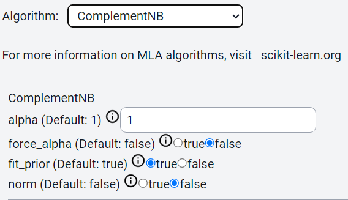
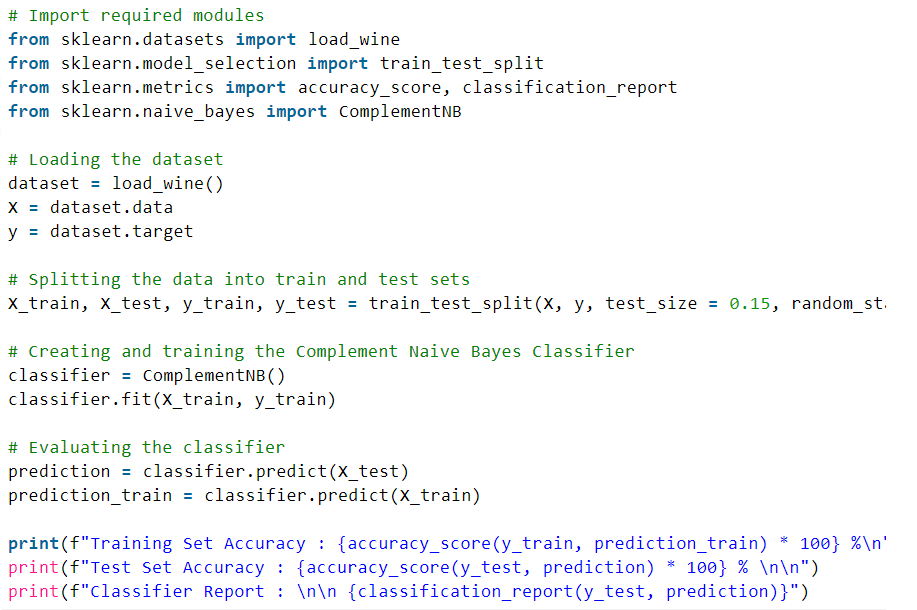
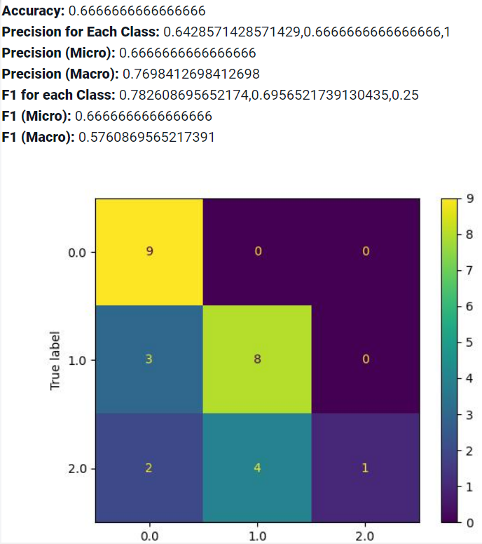
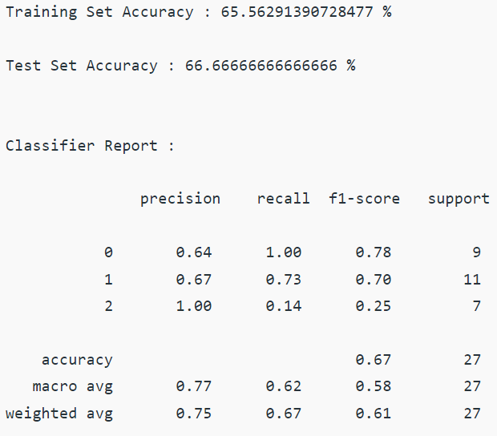

Complement Naive Bayes
=====

.. _installation:

Introduction
------------
This guide provides steps to perform Complement Naive Bayes analysis in Cycon ML/AI platform, and compares it with the code available within Kaggle platform.

.. note::
   * Name: Advertising CSV
   * Path: Tests/sampleCSVs/Wine_dataset.csv
   * Kaggle: https://www.kaggle.com/code/sandeepchamunni/bernoulli-naive-bayes-classifier/notebook 
   * Shape: (178, 13)
   * Classes:  (class 0, class 1, and class 2) of wine
   * Purpose: Classify classes of wine based on the propeties

Data
----------------

.. figure:: /Images/CN(1).png
   :width: 700

.. Preprocessing 
.. --------------
.. CyCon 
.. ----------
.. .. image:: ./Images/LR2.png
..    :width: 700

.. Kaggle
.. -------
.. .. code-block:: python

..    from sklearn.model_selection import train_test_split
..    X = ad_data[['Daily Time Spent on Site', 'Age', 'Area Income',
..        'Daily Internet Usage','Male']]
..    ad_data.columns
..    y = ad_data['Clicked on Ad']
..    X_train,X_test,y_train,y_test = train_test_split(X,y,test_size=0.4)

Method
----------------
CyCon
------

Kaggle
--------

Result 
------------
CyCon
------

Kaggle
-----------

