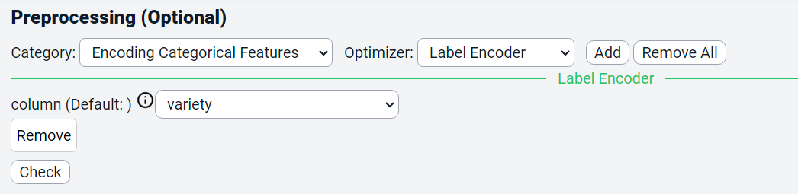
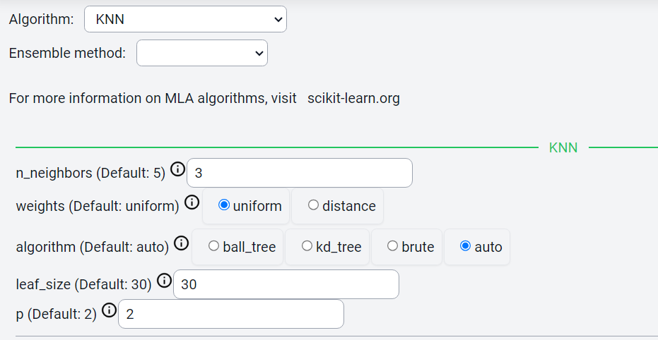
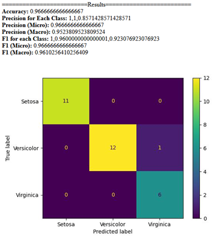
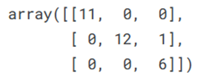

KNN
=====

.. _installation:

Introduction
------------
This guide provides steps to perform KNN analysis in Cycon ML/AI platform, and compares it with the code available within Kaggle platform.

.. note::
   * Name: Iris CSV
   * Path: Tests/sampleCSV_MLA_Classification/iris.csv
   * Kaggle: https://www.kaggle.com/code/skalskip/iris-data-visualization-and-knn-classification
   * Shape: (150, 5)
   * Classes:   Iris-setosa, Iris-versicolor, Iris-virginica
   * Purpose: Identify class of iris flowers given petal information.

Data
-------
.. figure:: /Images/KNN(1).png
   :width: 700

Preprocessing 
----------------
CyCon 
---------

Kaggle
------
.. code-block:: python

   from sklearn.preprocessing import LabelEncoder
   le = LabelEncoder()
   y = le.fit_transform(y)

Method 
-------
CyCon
-------

kaggle
--------

.. code-block:: python

   X_train, X_test, y_train, y_test = train_test_split(X, y, test_size = 0.2, random_state = 0)
   KNN = KNeighborsClassifier(n_neighbors=3)
   KNN.fit(X_train,y_train) 

Result
=========
CyCon
--------

Kaggle
--------

