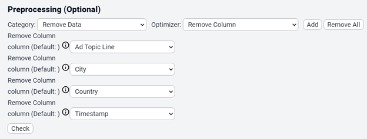
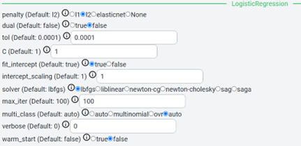
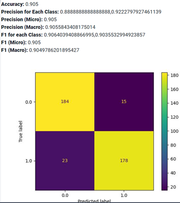
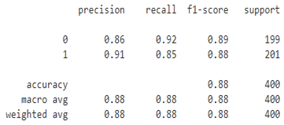

Logistic regression
=====

.. _installation:

Introduction
------------

This guide is a comparative analysis on Cycon’s ability to perform Logistic regression classification. This serves as proof that the Cycon page is able to perform Logistic regression. 
The following shows Logistic regression results for various datasets.

.. note::
   * Name: Advertising CSV
   * Path: Tests/sampleCSV_MLA_Classification/advertising.csv
   * Kaggle: https://www.kaggle.com/code/parjanyaadityashukla/logistic-regression-project/notebook
   * Shape: (1000, 10)
   * Classes:  Clicked on Ad - 0 or 1 indicated clicking on Ad
   * Purpose: whether a user clicks on an ad or not

Settings
----------------

.. figure:: /Images/LR1.png
   :target: https://unsplash.com/
   :width: 700

|

.. code-block:: python

   from sklearn.model_selection import train_test_split
   X = ad_data[['Daily Time Spent on Site', 'Age', 'Area Income',
       'Daily Internet Usage','Male']]
   ad_data.columns
   y = ad_data['Clicked on Ad']
   X_train,X_test,y_train,y_test = train_test_split(X,y,test_size=0.4)

.. code-block:: python

   from sklearn.linear_model import LogisticRegression
   logmodel = LogisticRegression()
   logmodel.fit(X_train,y_train) 

Kaggle Score 
----------------

