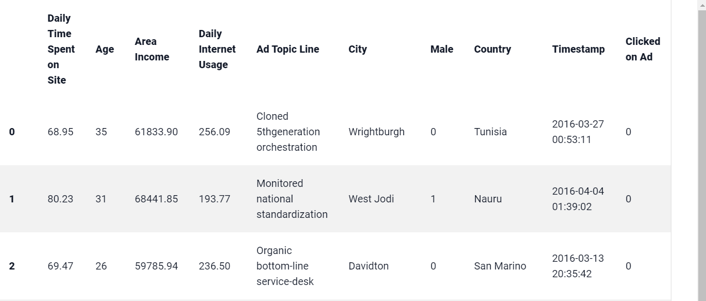

Logistic regression
=====

.. _installation:

Introduction
------------

This file is a comparative analysis on Cycon’s ability to perform Logistic regression classification. This serves as proof that the Cycon page is able to perform Logistic regression. 
The following shows Logistic regression results for various datasets.

.. note::

   * Shape: (1000, 10)
   * Classes:  Clicked on Ad - 0 or 1 indicated clicking on Ad
   * Purpose: whether a user clicks on an ad or not

Settings
----------------

A clickable image:

|

   

To retrieve a list of random ingredients,
you can use the function:

.. autofunction:: lumache.get_random_ingredients

The ``kind`` parameter should be either ``"meat"``, ``"fish"``,
or ``"veggies"``. Otherwise, :py:func:`lumache.get_random_ingredients`
will raise an exception.

.. autoexception:: lumache.InvalidKindError

For example:

>>> import lumache
>>> lumache.get_random_ingredients()
['shells', 'gorgonzola', 'parsley']

