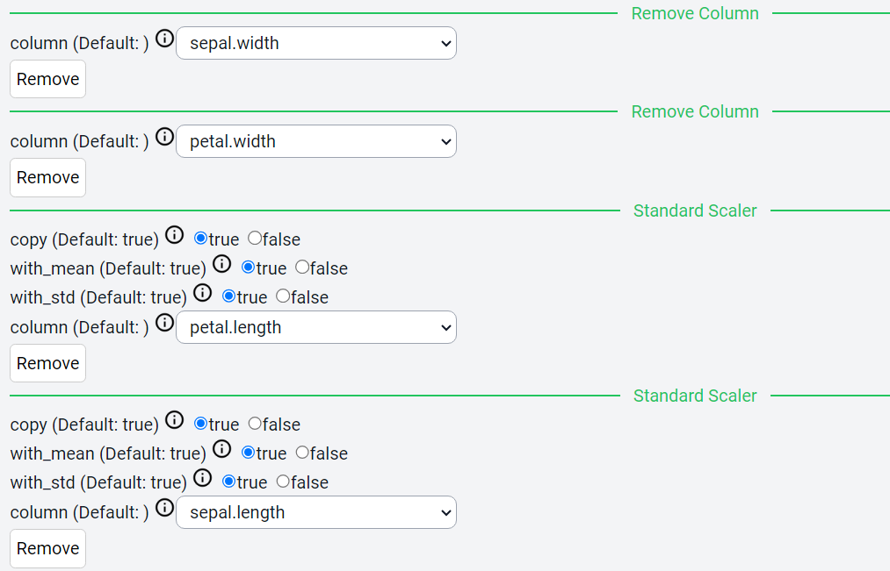
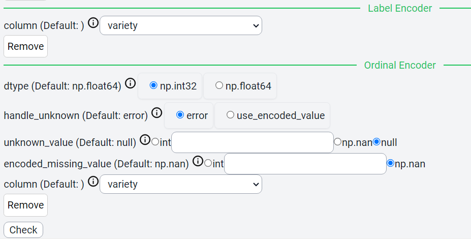
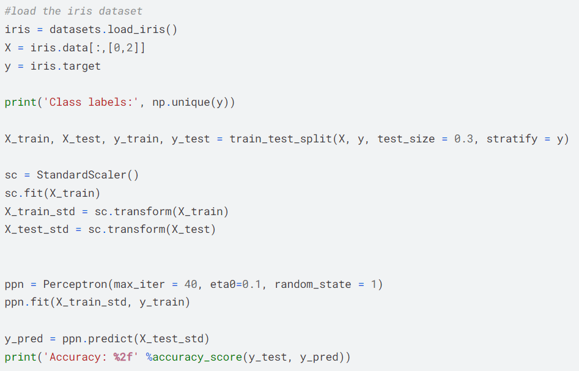
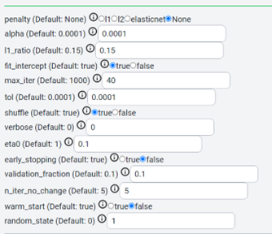
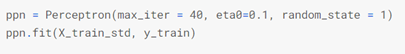
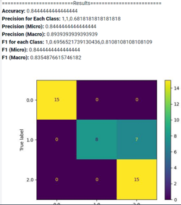
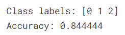

Perceptron
=====

.. _installation:

Introduction
------------
This guide provides steps to perform Perceptron analysis in Cycon ML/AI platform, and compares it with the code available within Kaggle platform.

.. note::
   * Name: Iris CSV
   * Path: Tests/sampleCSV_MLA_Classification/iris.csv
   * Kaggle: https://www.kaggle.com/code/nickthegreek82/perceptron-sklearn
   * Shape: (150, 5)
   * Classes:   Iris-setosa, Iris-versicolor, Iris-virginica
   * Purpose: Identify class of iris flowers given petal information.

Data
----------------

.. figure:: /Images/KNN(1).png
   :width: 700

Preprocessing 
----------------

CyCon
------

Kaggle
------

.. .. code-block:: python

..    from sklearn.model_selection import train_test_split
..    X = ad_data[['Daily Time Spent on Site', 'Age', 'Area Income',
..        'Daily Internet Usage','Male']]
..    ad_data.columns
..    y = ad_data['Clicked on Ad']
..    X_train,X_test,y_train,y_test = train_test_split(X,y,test_size=0.4)

Method
----------------

CyCon
------

kaggle
--------

Result
--------
CyCon
------

Kaggle
-------

