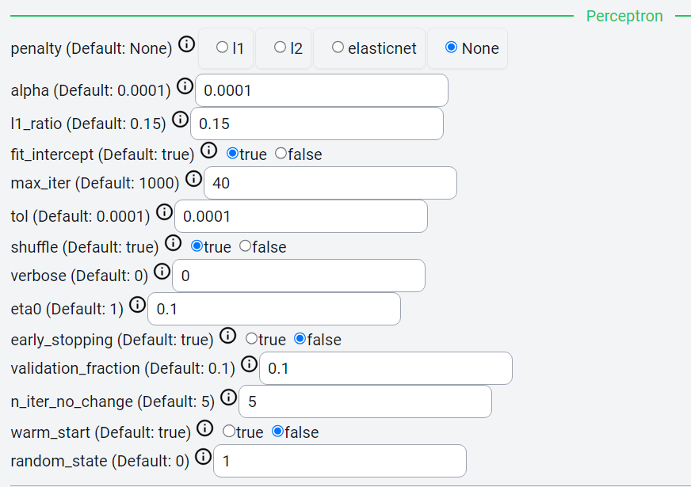

Perceptron
=====

.. _installation:

Introduction
------------
This file is a comparative analysis on Cycon’s ability to perform Perceptron classification. 
This serves as proof that the Cycon page is able to perform Perceptron. The following shows perceptron results for various datasets.

.. note::
   * Name: Iris CSV
   * Path: Tests/sampleCSV_MLA_Classification/iris.csv
   * Kaggle: https://www.kaggle.com/code/nickthegreek82/perceptron-sklearn
   * Shape: (150, 5)
   * Classes:   Iris-setosa, Iris-versicolor, Iris-virginica
   * Purpose: Identify class of iris flowers given petal information.

Settings
----------------

.. figure:: /Images/KNN(1).png
   :width: 700

Preprocessing using CyCon 
----------------

Preprocessing Kaggle
----------------
.. image:: ./Images/Perc(1).png
   :width: 700
.. .. code-block:: python

..    from sklearn.model_selection import train_test_split
..    X = ad_data[['Daily Time Spent on Site', 'Age', 'Area Income',
..        'Daily Internet Usage','Male']]
..    ad_data.columns
..    y = ad_data['Clicked on Ad']
..    X_train,X_test,y_train,y_test = train_test_split(X,y,test_size=0.4)

Perceptron parameters in CyCon 
----------------

Perceptron parameters in kaggle
----------------
.. image:: ./Images/Perc(3).png
   :width: 700

CyCon Score 
----------------
.. image:: ./Images/Perc(5).png
   :width: 450

Kaggle Score 
----------------

