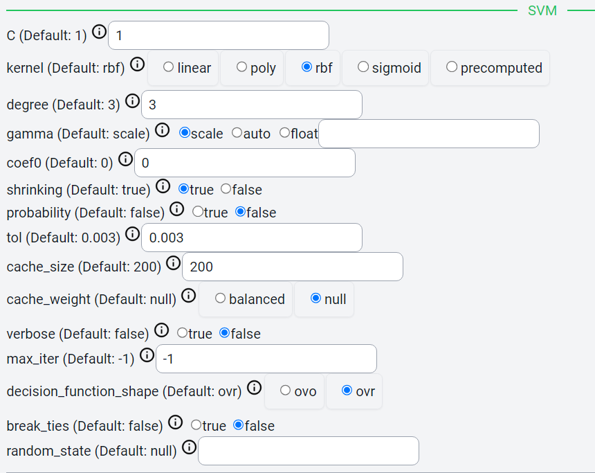
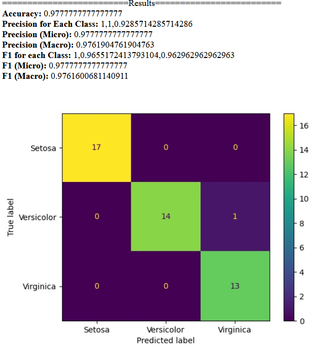
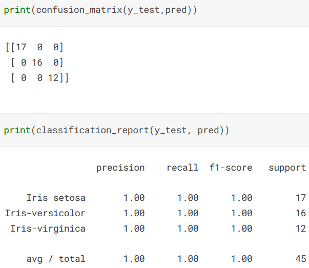

Support Vector Machine
=====

.. _installation:

Introduction
------------
This guide provides steps to perform SVM analysis in Cycon ML/AI platform, and compares it with the code available within Kaggle platform.

.. note::
   * Name: Iris CSV
   * Path: Tests/sampleCSV_MLA_Classification/iris.csv
   * Kaggle: https://www.kaggle.com/code/arshid/support-vector-machine-on-iris-flower-dataset
   * Shape: (150, 5)
   * Classes:   Iris-setosa, Iris-versicolor, Iris-virginica
   * Purpose: Identify class of iris flowers given petal information.

Data
-------
.. figure:: /Images/KNN(1).png
   :width: 700

Method 
-------
CyCon
-------

kaggle
--------

.. code-block:: python

    x=iris.iloc[:,:-1]
    y=iris.iloc[:,4]
    x_train,x_test, y_train, y_test=train_test_split(x,y,test_size=0.30)
    model=SVC()
    model.fit(x_train, y_train)

Result
=========
CyCon
--------

Kaggle
--------

